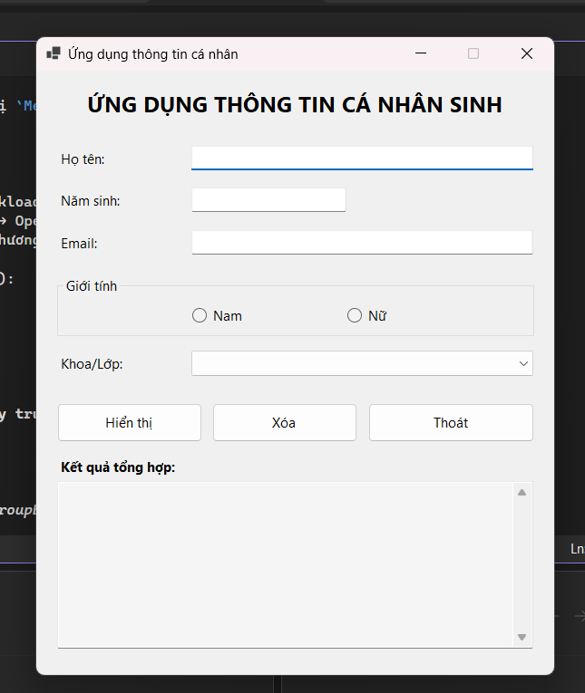
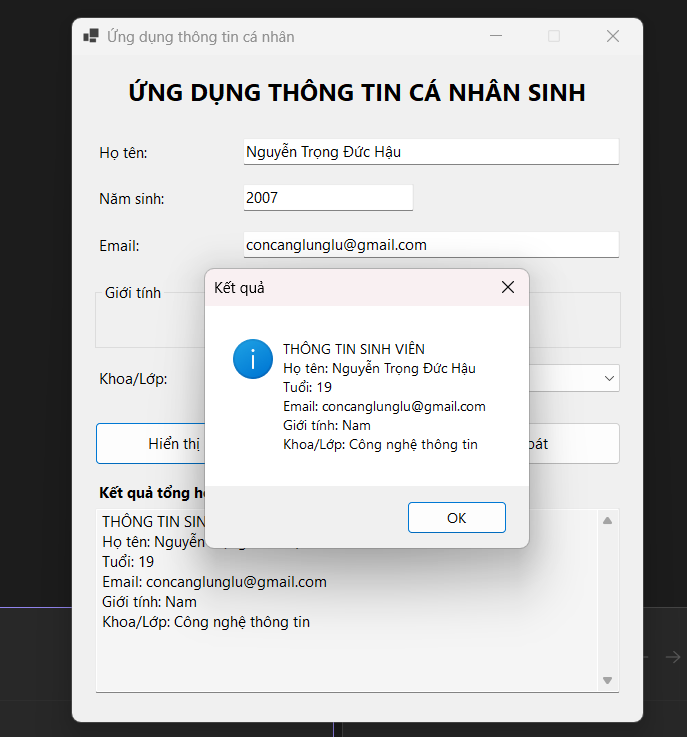
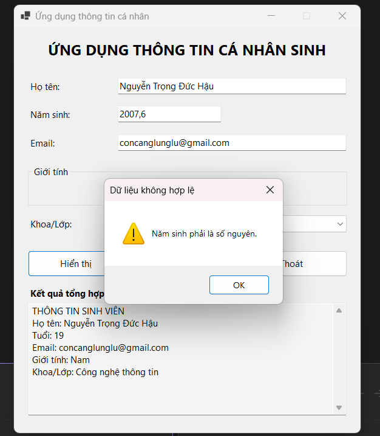
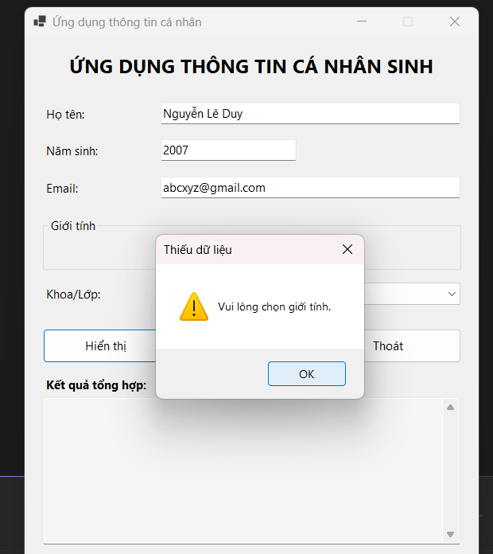
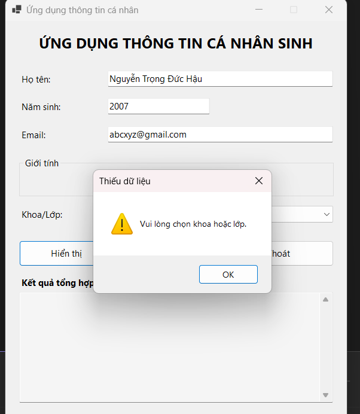
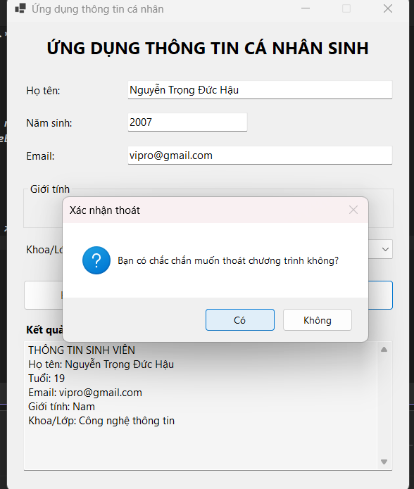

# BÀI LAB 01 - ỨNG DỤNG THÔNG TIN CÁ NHÂN

**Môn học:** COMP1019 - Lập trình trên Windows
**Loại ứng dụng:** Windows Forms App (.NET 8, C#)

## 1. Mô tả

Ứng dụng cho phép nhập thông tin cá nhân sinh viên (họ tên, năm sinh, email, giới tính, khoa/lớp),
kiểm tra tính hợp lệ của dữ liệu, sau đó hiển thị thông tin tổng hợp (bao gồm tuổi được tính từ năm sinh)
khi người dùng nhấn nút **Hiển thị**.

## 2. Cấu trúc project

```
StudentInfoApp/
├── StudentInfoApp.csproj   # File project (.NET 8 Windows Forms)
├── Program.cs              # Điểm khởi đầu chương trình (Main)
├── Form1.cs                # Logic xử lý sự kiện (Hiển thị / Xóa / Thoát)
├── Form1.Designer.cs       # Thiết kế giao diện (khai báo & bố trí control)
└── README.md                # Tài liệu mô tả (file này)
```

## 3. Danh sách control và tên theo quy ước

| STT | Control | Tên | Chức năng |
|---|---|---|---|
| 1 | Label | lblTitle | Tiêu đề chương trình |
| 2 | TextBox | txtHoTen | Nhập họ tên |
| 3 | TextBox | txtNamSinh | Nhập năm sinh |
| 4 | TextBox | txtEmail | Nhập email |
| 5 | RadioButton | radNam, radNu | Chọn giới tính (trong GroupBox) |
| 6 | ComboBox | cboKhoa | Chọn khoa/lớp (4 lựa chọn có sẵn) |
| 7 | Button | btnHienThi | Hiển thị thông tin |
| 8 | Button | btnXoa | Xóa dữ liệu đã nhập |
| 9 | Button | btnThoat | Thoát chương trình (có xác nhận) |
| 10 | TextBox | txtKetQua | Hiển thị kết quả tổng hợp |

## 4. Kiểm tra dữ liệu đã cài đặt

- Họ tên không được rỗng.
- Năm sinh không được rỗng, phải là số nguyên hợp lệ.
- Năm sinh phải nằm trong khoảng 1900 → năm hiện tại.
- Email không được rỗng.
- Phải chọn giới tính (Nam/Nữ).
- Phải chọn khoa/lớp trong ComboBox.

Nếu thiếu/sai bất kỳ điều kiện nào, chương trình hiển thị `MessageBox` cảnh báo tương ứng và không cho
hiển thị kết quả.

## 5. Cách chạy chương trình (Visual Studio)

1. Cài đặt **Visual Studio 2022** (hoặc mới hơn) với workload **".NET desktop development"**.
2. Mở thư mục `StudentInfoApp` bằng Visual Studio (File → Open → Project/Folder → chọn `StudentInfoApp.csproj`).
3. Nhấn **F5** hoặc bấm nút **Start** để build và chạy chương trình.

> Có thể chạy bằng dòng lệnh (Windows, đã cài .NET 8 SDK):
> ```
> dotnet run
> ```

## 6. Kết quả chạy chương trình

### 6.1 Giao diện khi mở chương trình


*Mô tả: Giao diện gồm các ô nhập liệu Họ tên, Năm sinh, Email; nhóm giới tính (GroupBox) với 2 RadioButton
Nam/Nữ; ComboBox Khoa/Lớp; 3 nút lệnh Hiển thị, Xóa, Thoát; và ô Kết quả tổng hợp ở cuối form. Tất cả các
control đều đang ở trạng thái trống/ban đầu.*

### 6.2 Nhập dữ liệu hợp lệ và nhấn "Hiển thị"


*Mô tả: Với dữ liệu Họ tên = Nguyễn Trọng Đức Hậu, Năm sinh = 2007, Email = concanglunglu@gmail.com,
Giới tính = Nam, Khoa = Công nghệ thông tin, chương trình tính đúng tuổi = 2026 − 2007 = 19 và hiển thị
đầy đủ thông tin bằng MessageBox, đồng thời cập nhật vào ô Kết quả tổng hợp trên form.*

### 6.3 Kiểm tra dữ liệu không hợp lệ

**a) Năm sinh không phải số nguyên**


*Mô tả: Khi năm sinh nhập sai định dạng (ví dụ "2007,6"), chương trình hiển thị MessageBox cảnh báo
"Năm sinh phải là số nguyên." và không cho hiển thị kết quả.*

**b) Chưa chọn giới tính**


*Mô tả: Khi chưa tick chọn RadioButton Nam hoặc Nữ, chương trình hiển thị MessageBox cảnh báo
"Vui lòng chọn giới tính."*

**c) Chưa chọn khoa/lớp**


*Mô tả: Khi chưa chọn mục nào trong ComboBox Khoa/Lớp, chương trình hiển thị MessageBox cảnh báo
"Vui lòng chọn khoa hoặc lớp."*

### 6.4 Chức năng Thoát


*Mô tả: Khi nhấn nút Thoát, chương trình hiển thị hộp thoại xác nhận Yes/No ("Bạn có chắc chắn muốn thoát
chương trình không?") trước khi đóng ứng dụng, tránh thoát nhầm khi đang nhập dữ liệu.*
