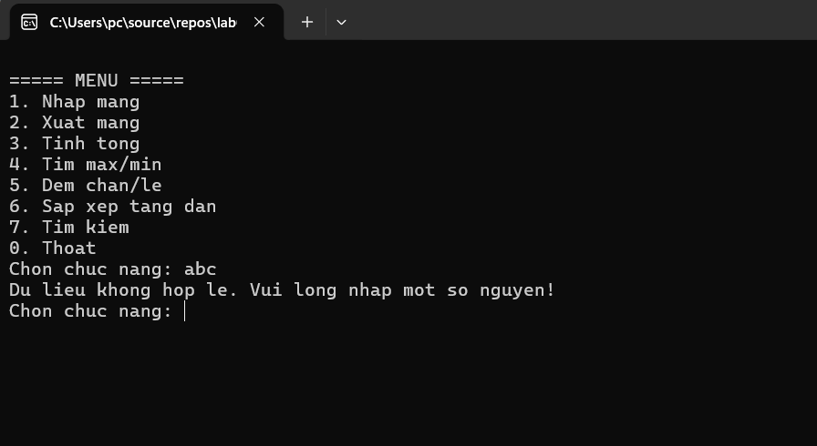
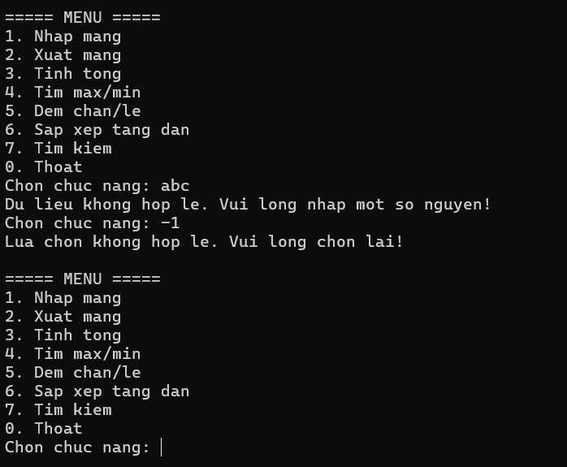
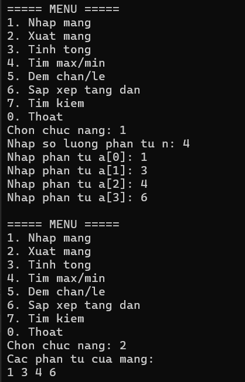
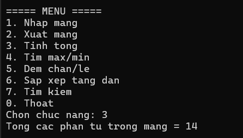
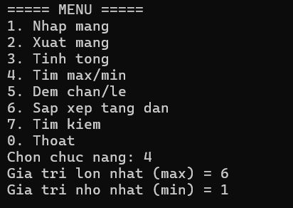
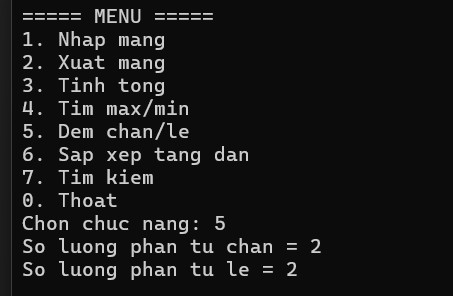
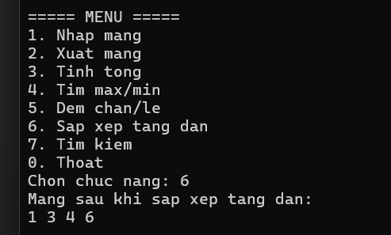
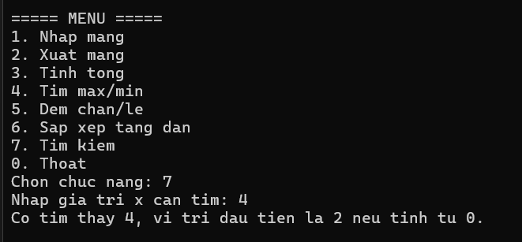
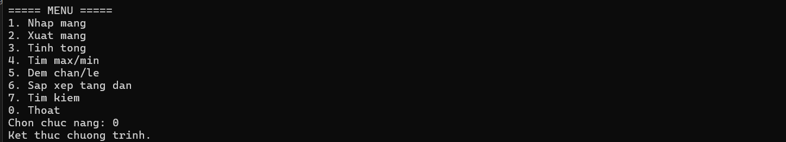

# BÀI LAB 02 - QUẢN LÝ MẢNG SỐ NGUYÊN BẰNG CONSOLE

**Môn học:** COMP1019 - Lập trình trên Windows
**Loại ứng dụng:** Console App (.NET 8, C#)

## 1. Mô tả

Chương trình Console quản lý một mảng số nguyên thông qua menu lựa chọn. Người dùng có thể nhập mảng,
xuất mảng, tính tổng, tìm max/min, đếm số chẵn/lẻ, sắp xếp tăng dần và tìm kiếm một giá trị trong mảng.
Sau khi thực hiện xong một chức năng, chương trình quay lại menu cho đến khi người dùng chọn **0. Thoát**.

## 2. Cấu trúc project

```
QuanLyMang/
├── QuanLyMang.csproj   # File project (.NET 8 Console App)
├── Program.cs          # Toàn bộ logic chương trình, tách thành các phương thức
└── README.md            # Tài liệu mô tả (file này)
```

## 3. Danh sách phương thức đã cài đặt

| Phương thức | Chức năng |
|---|---|
| `HienThiMenu()` | In menu ra màn hình |
| `NhapLuaChonMenu()` | Nhập và kiểm tra lựa chọn menu (0–7), không cho chương trình crash nếu nhập sai |
| `KiemTraDaNhapMang()` | Kiểm tra người dùng đã nhập mảng chưa trước khi cho xử lý các chức năng khác |
| `NhapSoNguyen(string message)` | Nhập một số nguyên bất kỳ, có kiểm tra định dạng |
| `NhapSoNguyenDuong(string message)` | Nhập một số nguyên dương (n > 0), có kiểm tra định dạng |
| `NhapMang()` | Nhập số lượng phần tử n và n phần tử của mảng |
| `XuatMang(int[] a)` | In toàn bộ phần tử của mảng |
| `TinhTong(int[] a)` | Tính tổng các phần tử |
| `TimMax(int[] a)` / `TimMin(int[] a)` | Tìm giá trị lớn nhất / nhỏ nhất |
| `DemChan(int[] a)` / `DemLe(int[] a)` | Đếm số lượng phần tử chẵn / lẻ |
| `SapXepTangDan(int[] a)` | Sắp xếp mảng tăng dần (Selection Sort), thay đổi trực tiếp trên mảng |
| `TimKiem(int[] a, int x)` | Tìm kiếm tuần tự, trả về vị trí đầu tiên tìm thấy (từ 0) hoặc -1 nếu không có |

`Main()` chỉ đảm nhiệm vòng lặp menu và gọi các phương thức trên, không xử lý logic trực tiếp trong `Main`.

## 4. Các yêu cầu kỹ thuật đã đáp ứng

- ✅ Project dạng Console App C# (.NET 8).
- ✅ Chương trình được tách thành nhiều phương thức nhỏ, không viết toàn bộ trong `Main`.
- ✅ Kiểm tra dữ liệu nhập cho số lượng phần tử (`NhapSoNguyenDuong` yêu cầu nhập lại nếu n ≤ 0 hoặc
  không phải số) và cho lựa chọn menu (`NhapLuaChonMenu` chỉ chấp nhận số nguyên từ 0–7).
- ✅ Không cho thực hiện các chức năng 2–7 nếu chưa nhập mảng (`KiemTraDaNhapMang`), sẽ hiển thị thông báo
  yêu cầu nhập mảng trước.
- ✅ Tên biến, tên phương thức rõ nghĩa (tiếng Việt không dấu, theo gợi ý đề bài).
- ✅ Chương trình không bị dừng bất thường khi nhập sai lựa chọn menu hoặc sai định dạng số — luôn yêu
  cầu nhập lại thông qua vòng lặp `while (true)` kết hợp `int.TryParse`.

## 5. Cách chạy chương trình

### Bằng Visual Studio
1. Cài đặt **Visual Studio 2022** (hoặc mới hơn) với workload **".NET desktop development"**.
2. Mở thư mục `QuanLyMang` bằng Visual Studio (File → Open → Project/Folder → chọn `QuanLyMang.csproj`).
3. Nhấn **F5** hoặc **Ctrl+F5** để build và chạy chương trình.

### Bằng dòng lệnh (đã cài .NET 8 SDK)
```
cd QuanLyMang
dotnet run
```

## 6. Dữ liệu kiểm thử gợi ý

| STT | Dữ liệu nhập | Kết quả mong đợi |
|---|---|---|
| 1 | 5 phần tử: 4 1 9 2 7 | Tổng = 23, max = 9, min = 1, chẵn = 2, lẻ = 3 |
| 2 | 4 phần tử: -3 0 8 -1 | Tổng = 4, max = 8, min = -3, chẵn = 2, lẻ = 2 |
| 3 | Tìm x = 9 trong mảng 4 1 9 2 7 | Tìm thấy, vị trí đầu tiên là 2 (tính từ 0) |
| 4 | Tìm x = 5 trong mảng 4 1 9 2 7 | Không tìm thấy |
| 5 | Nhập n = 0 hoặc n âm | Chương trình yêu cầu nhập lại |

## 7. Kết quả chạy chương trình

Dữ liệu thực tế dùng để kiểm thử: nhập mảng gồm 4 phần tử **1 3 4 6**.

### 7.1 Kiểm tra dữ liệu nhập sai định dạng


*Mô tả: Khi nhập lựa chọn menu là chữ ("abc"), chương trình không bị dừng bất thường mà hiển thị
"Du lieu khong hop le. Vui long nhap mot so nguyen!" và yêu cầu nhập lại.*

### 7.2 Kiểm tra lựa chọn menu ngoài phạm vi


*Mô tả: Tiếp tục nhập "-1" (ngoài khoảng 0–7), chương trình báo "Lua chon khong hop le. Vui long chon
lai!" rồi in lại menu và chờ nhập lại, không crash chương trình.*

### 7.3 Nhập mảng và xuất mảng


*Mô tả: Chọn chức năng 1, nhập n = 4 và lần lượt các phần tử a[0]=1, a[1]=3, a[2]=4, a[3]=6. Sau đó chọn
chức năng 2 để xuất mảng, kết quả in ra đúng "1 3 4 6".*

### 7.4 Tính tổng


*Mô tả: Chọn chức năng 3, chương trình tính đúng tổng các phần tử = 1 + 3 + 4 + 6 = 14.*

### 7.5 Tìm max/min


*Mô tả: Chọn chức năng 4, chương trình in đúng giá trị lớn nhất (max) = 6 và giá trị nhỏ nhất (min) = 1.*

### 7.6 Đếm số chẵn/lẻ


*Mô tả: Chọn chức năng 5, mảng 1 3 4 6 có 2 số chẵn (4, 6) và 2 số lẻ (1, 3) — khớp với kết quả in ra.*

### 7.7 Sắp xếp tăng dần


*Mô tả: Chọn chức năng 6, mảng vốn đã theo thứ tự tăng dần nên sau khi sắp xếp vẫn giữ nguyên "1 3 4 6".*

### 7.8 Tìm kiếm phần tử


*Mô tả: Chọn chức năng 7, nhập x = 4, chương trình tìm thấy và báo đúng vị trí đầu tiên là 2 (tính từ 0),
vì mảng là [1, 3, 4, 6] và phần tử 4 nằm ở chỉ số 2.*

### 7.9 Thoát chương trình


*Mô tả: Chọn chức năng 0, chương trình in "Ket thuc chuong trinh." và kết thúc vòng lặp, không cần xác
nhận thêm vì đây là ứng dụng Console.*
